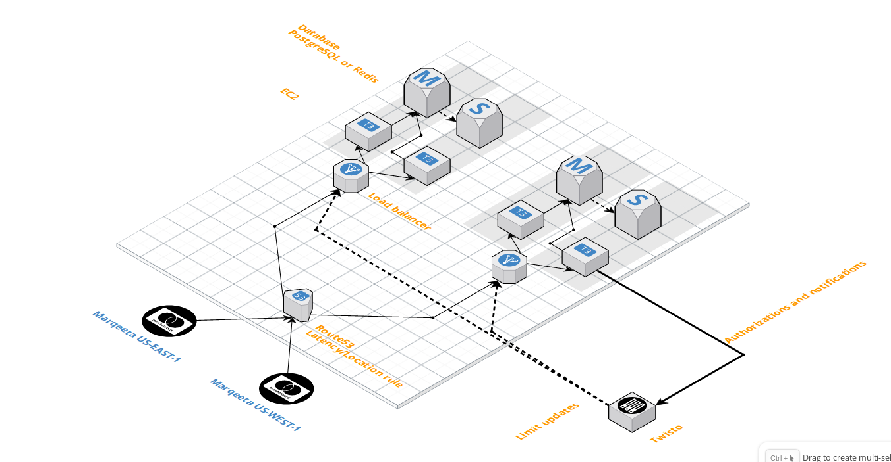

# Cardproxy

Cardproxy is a service acting as proxy for Marqeta's JIT requests,
and as backup if twisto-backend fails.

Sometimes it's also referred to as card_auth_proxy.

## Basic JIT authorization workflow

Marqeta sends the JIT request to cardproxy (`JITView.post`),
which subsequently calls twisto-backend (`JITAuthorizationView`).
If twisto-backend returns a result in time,
cardproxy just relays it back to Marqeta.

After each relevant change to a customer,
like a new transaction,
`marqeta.UpdateCustomerTask` sends up-to-date customer data to cardproxy,
which then stores this data in Redis.

Cardproxy has access to cached data - `CustomerData`.
If twisto-backend fails to respond,
cardproxy makes the authorization decision based on this data in cache.

If cardproxy fails to return a valid response to Marqeta in time,
Marqeta declines the transaction.

## Cardproxy - twisto-backend dependency

The code in `twisto/libs/marqeta` is shared between cardproxy and twisto-backend.

When making changes, it's important to keep backwards compatibility in mind.
New versions of twisto-backend and cardproxy are released independently and cannot be synchronized.
Cardproxy's data cache cannot be updated for all customers at once,
and cannot be synchronized with releases of new code.

Also, twisto-backend will usually be released first, because there's an automated process.
New versions of cardproxy need to be released manually.

Practical example: we want to add a new condition in `AuthorizationEngine` based on a new field in `CustomerData`.
Cardproxy needs to function even if it starts receiving new fields in `CustomerData`.
After the new version of cardproxy is deployed, `AuthorizationEngine` code needs to function even if the new data field is empty,
to cover cases when cardproxy cache wasn't updated since the release of twisto-backend.

## Internal architecture

Cardproxy is deployed on AWS.
There are 2 environments - one in `us-east-1` and `us-west-1`.
Each has its own Beanstalk cluster and Redis cluster.

---

# 👴 Legacy docs, possibly outdated

Prostředí jsou v podřízeném AWS účtu. Admin hlavního účtu se do tohoto podřízeného může
přepnout na adrese https://signin.aws.amazon.com/switchrole?account=308520510196&roleName=OrganizationAccountAccessRole&displayName=Twisto%20Cardproxy

### DNS

aws.twistopay.com je zóna spravovaná v Route 53, twistopay.com je v Cloudflare a obsahuje
NS záznamy.

- https://cardauth.aws.twistopay.com - primary enpoint for Marqeta with latency based routing
- Pozn. Heathchecky v Route 53 nepoužíváme.
- https://cardauth.us-east-1.aws.twistopay.com - used by the app only for limit upload
- https://cardauth.us-west-1.aws.twistopay.com - used by the app only for limit upload

### Vytvoření prostředí

    $ git clone git@github.com:TwistoPayments/ansible-servers.git
    $ cd ansible-servers/terraform/cardauth/prod-us-east-1
    $ terraform apply
    $ cd ../prod-us-west-1
    $ terraform apply

### Secrets

Tyto env vars je po aplikování Terraformu třeba jednorázově vytvořit ručně:

- ONLINE_AUTH_URL
- PROXY_SECRET_LINK
- SENTRY_DSN

Pozn. změna proměnných vyvolá bezodstávkový re-deploy Beanstalk prostředí.

Dále je třeba jednorázově přepsat tyto soubory se správným tokenem uvnitř. Token je stejný jako máme v Kubernetes:
s3://twisto-card-auth-prod-us-east-1/docker.config.json
s3://twisto-card-auth-prod-us-west-1/docker.config.json

### Logování

- Logy docker aplikace lze získat přes Beanstalk web UI. Buď posledních 100 řádků nebo komplet /var zabalený v zipu.
- EC2 streamují logy do CloudWatch Logs.
- Logování load balanceru není zapnuté.
