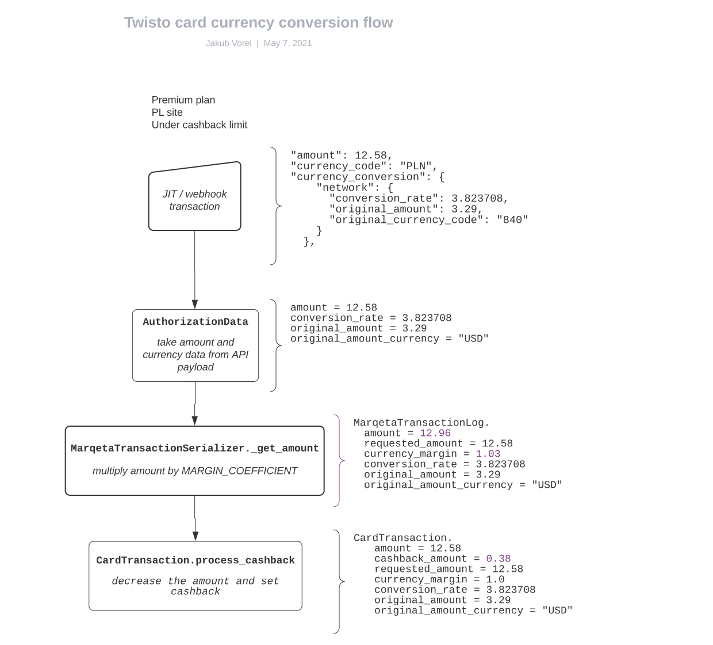

# Currencies

## Basic facts

Cards are created in a currency based on the user's country (`Site`).

For non-premium users,
Twisto is adding a 3% markup (`CardTransaction.MARGIN_COEFFICIENT`) on top of foreign currency payments.
This fee does not apply to premium users, up to a certain monthly limit (`CardCashbackConfig`).

## Foreign-currency payment flow

1. With every `MarqetaTransactionLog`, we receive info with amounts:

   ```
   ...
   "amount": 12.58,
   "currency_code": "PLN",
   "currency_conversion": {
       "network": {
         "conversion_rate": 3.823708,
         "original_amount": 3.29,
         "original_currency_code": "840"
       }
     },
   ...
   ```

   The numeric currency code is according to ISO 4217,
   conversion to text representation is handled by `moneyed` library.

2. In `MarqetaTransactionSerializer._get_amount`

   For every debit transaction log, the amount is multiplied by the `MARGIN_COEFFICIENT`.
   Even for premium users.
   Every `MarqetaTransactionLog.amount` already includes the margin fee.

3. Removing the currency conversion markup in `process_cashback`

   If the `CardTransaction` is eligible for cashback
   (conditions in `has_cashback` property - mainly depends on the user's plan and monthly cashback limit),
   the conversion fee is removed.

   `CardTransaction.amount` contains the final amount without the fee,
   and `CardTransaction.cashback_amount` contains the cashback deducted from the amount.



## Currency-related gotchas

### Inconsistency between `CardTransaction` and `MarqetaTransactionLog`

The `MARGIN_COEFFICIENT` is applied on top of every debit `MarqetaTransactionLog` instance,
and is already included in the `amount` value.
On `CardTransaction` level, `amount` is the final value shown to the user.
If the cashback was applied, it's subtracted from the `amount`.
This results in `MarqetaTransactionLog.amount != CardTransaction.amount`.
