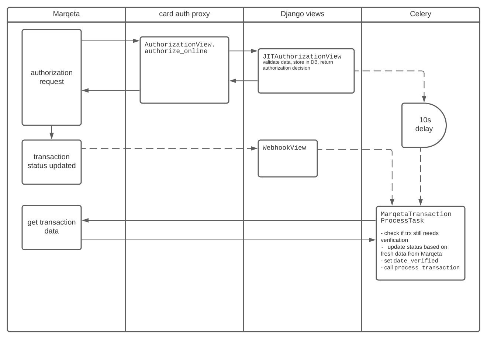

# Transactions

🟢 This file should contain:

- info about known issues, irregular or unexpected behavior of our implementation of transaction handling
- links to relevant / interesting parts of Marqeta docs.
  But don't overdo it.
  URLs change and Marqeta docs have a nice index + search already.

❌ Things that do not belong here:

- generic information that can also be found in other sources, mainly Marqeta docs.

## Transaction processing

For JIT transaction events, we store the transaction data in the DB and return the authorization result (accepted / declined).
Transaction event is fully processed only after verification.

Verification means getting the transaction data from Marqeta, and comparing / updating our local DB record.
Currently, only the `status` field is implemented.
It is important to cover cases when the JIT endpoint says the transaction should be authorized,
but something unexpected happens along the way between our JIT endpoint and Marqeta,
causing Marqeta to have a different transaction status (eg. declined or error).

Only verified transactions (`CardTransaction.is_verified`) are visible to the user.
Processing happens in the `MarqetaTransactionLog.process_transaction` method.



If both webhook and `MarqetaTransactionProcessTask` delayed task fail to verify the transaction,
there's a periodic Celery task called `marqeta-process-unverified-transactions-task`
that attempts to verify all unverified transactions in the database.

Race condition can happen when Marqeta sends a webhook at the same time as we try to execute the scheduled `MarqetaTransactionProcessTask`.
Or even with JIT (eg. in case of cardproxy performance issues, Marqeta's request to cardproxy would time out,
Marqeta declines the transaction and sends a webhook with the updated state).

In code, race conditions are prevented by using `redis_lock` in `JITAuthorizationView.post` and `MarqetaTransactionProcessTask.run`.

## Transaction types

Transaction types are listed in [Marqeta docs](https://www.marqeta.com/docs/developer-guides/ledger-management-with-jit-funding#_ledger_impacting_transaction_events).

### `authorization.advice`

Even though Marqeta defines `authorization.advice` as a transaction that replaces the previously authorized amount,
we treat it as a reversal transaction.

This is fine from a customer's point of view,
because all advices so far had `pgfs.authorization.reversal` method
and `data['gpa_order']['jit_funding']['amount']` contains the amount to be subtracted from the current transaction amount.

| transaction type       | user-facing amount | `data['amount']` | `data['gpa_order']['jit_funding']['amount']` |
| ---------------------- | ------------------ | ---------------- | -------------------------------------------- |
| authorization          | 400                | 400              | 400                                          |
| authorization.advice   | 300                | 300              | 100                                          |
| authorization.clearing | 300                | 300              | 300                                          |

authorization.advice example (simplified):

```json
"amount": 167.2,  <- the new amount after advice is processed
"gpa_order": {
  "amount": 295.6, <- amount being subtracted from the preceding transaction
  "funding": {
    "amount": 295.6
  },
  "jit_funding": {
    "amount": 295.6,
    "method": "pgfs.authorization.reversal"
  },
  "currency_code": "PLN"
},
"currency_code": "PLN",
"request_amount": 167.2,
"currency_conversion": {
  "network": {
    "conversion_rate": 0.6170652,
    "original_amount": 270.96,
    "original_currency_code": "208"
  }
},

```

There's an inconsistency of values in `MarqetaTransactionLog.amount`,
which contains the amount to be subtracted from the previous transaction,
and `original_amount`, containing the new amount after the subtraction.
